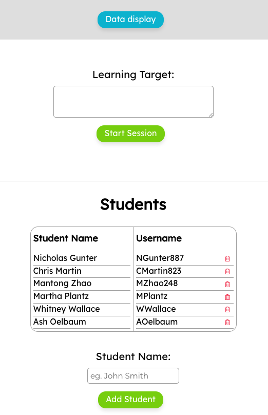
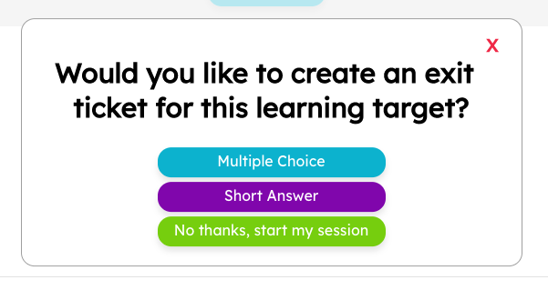
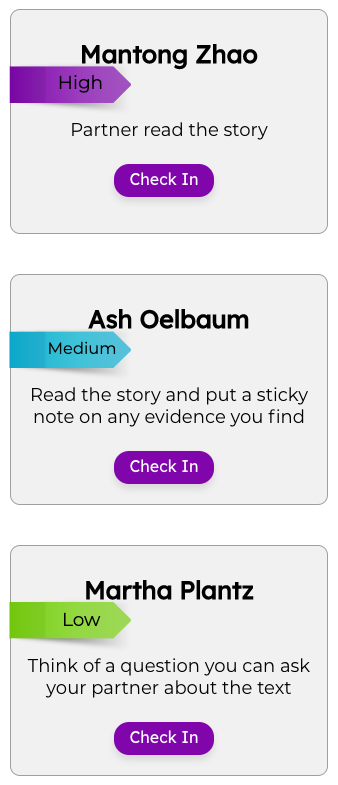
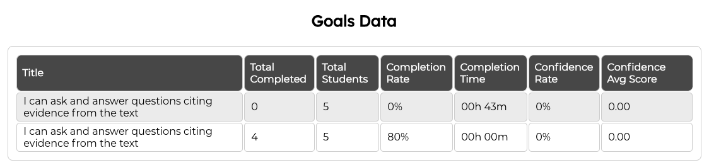

# Sprout
Live Link: [Sprout App](https://sprout-app.now.sh/)

## Developers:
```Ashley Oelbaum, Christopher Martin, Martha Plantz, Nicholas Gunter, Whitney Wallace, Mantong Zhao```

## What is Sprout?
Sprout is a formative assessment tool used to help teachers deliver specific, goal-oriented, and timely feedback in the classroom.

### Demo Account:
See what Sprout has to offer by using these login credentials:

#### *`Email: Teacher@email.com`*
#### *`Password: Password1!`*

## Screenshots
### Teacher Dashboard:


### Create an exit ticket before starting a session:


### Goal Session in use:


### Teacher View of real-time Exit Ticket responses:


### Teacher View of students ready for a check-in:


### Student Dashboard View of learning target and personalized goal:


### Student Self-Evaluation:


### Data Views:



## What's to come in Sprout:
1. Tooltips for dataview
2. Allow parents to create an account
3. Present student/class data for parents
4. Allow teachers to have multiple classes
5. Teachers can reset forgotten passwords
6. Calendar functionality 
7. Customizable timer lengths

#### Set up
- Clone the repo both client and server: 
[Sprout client](https://github.com/thinkful-ei-emu/ZOMGPOW-Client)
[Sprout Server](https://github.com/thinkful-ei-emu/ZOMGPOW-Server)
- Run `npm install`
- Run `npm test` in another window (everything green?)
- Run `npm start` in another window to start the server

### Deploy
`npm run deploy`

### Tech Stack - Frontend 
- JavaScript
- React
- HTML5
- CSS

### Tech Stack - Backend
- Node.js
- PostgreSQL

### Libraries
- Socket.io
- Express
- Knex

### Testing - Frontend
- Jest

### Testing - Backend
- Mocha
- Chai
- Supertest
